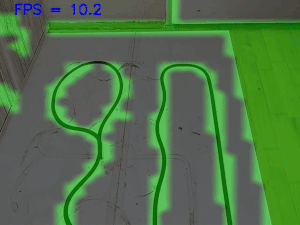
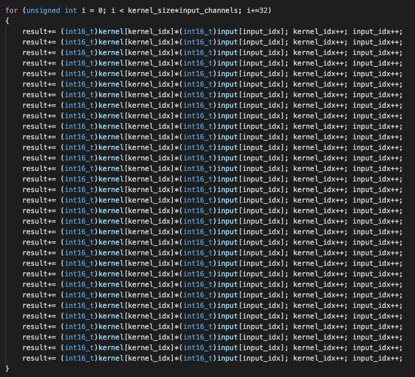
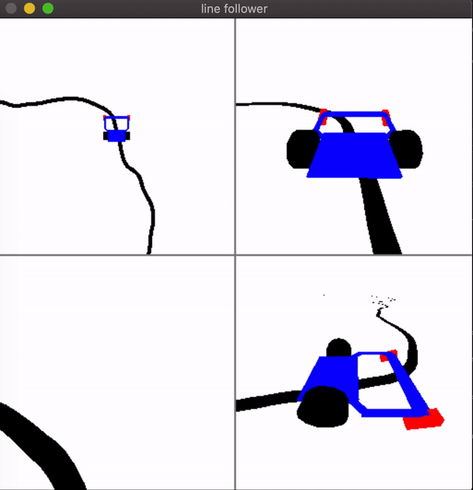
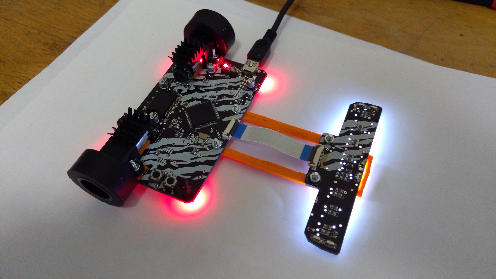
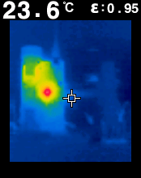
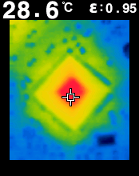
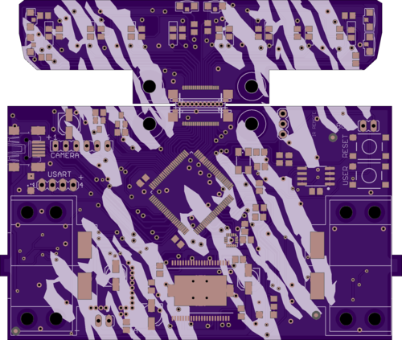

# end-to-end reinforcement learning line following robot

amazing project of embedded line follower robot using neural networks, trained with reinforcement learning


## line_detection_train
supervised line detector network,
this is ultra tiny network, for line detection, works well and can run on small MCU
for 512x512 input can run more than 120FPS on i5 (CPU only, no GPU)




network architecture : 
- input 96x96x1, grayscale camera input
- convolution 3x3x8, stride 2, activation ReLU
- convolution 3x3x8, stride 2, activation ReLU
- convolution 3x3x16, stride 2, activation ReLU
- convolution 3x3x32, stride 2, activation ReLU
- convolution 1x1x1, stride 1, output 6x6 feature map of line detection

torch model skeleton looks like : 
```python
self.layers = [ 
                nn.Conv2d(1, 8, kernel_size=3, stride=2, padding=1),
                nn.ReLU(), 

                nn.Conv2d(8, 8, kernel_size=3, stride=2, padding=1),
                nn.ReLU(), 

                nn.Conv2d(8, 16, kernel_size=3, stride=2, padding=1),
                nn.ReLU(), 

                nn.Conv2d(16, 32, kernel_size=3, stride=2, padding=1),
                nn.ReLU(), 
                       
                nn.Dropout(0.01),
                nn.Conv2d(32, 1, kernel_size=1, stride=1, padding=0)
            ]
```

thanks this MASSIVE UNROLLING you can worm up stm32f7 to maximum power :

idea is simple : 
- in common CNN feature layers ordering is : input\[channel\]\[y\]\[x\] , kernel\[filter\]\[channel\]\[ky\]\[kx\]
- here, the channel last reordering is used input\[y\]\[x\]\[channel\] , kernel\[filter\]\[ky\]\[kx\]\[channel\]
- we know, kx size is usualy 3, and channel is HUGE (32, 64, 128 ...), so : combination \[kx\]\[channel\] is long vector (3x32, 3x64, 3x128), and can be massive unrolled




## ai_gym_train 

reinfrocement learning off-line training, in custom AI gym env




## motoko_ascender

robot itself, powered by stm32f7, overclocked from 216MHz to 300MHz





new board version, motors are about to change



